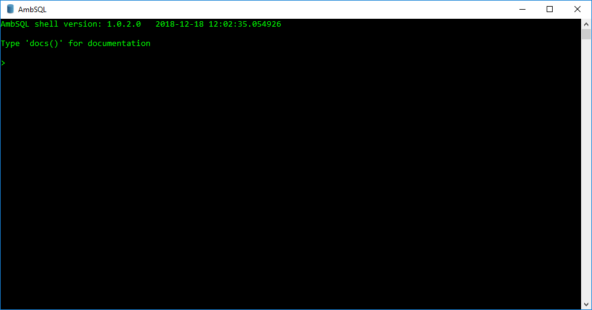

 
# AmbSQL
* AmbSQL is a Relational Database Management System which created with keeping in focus the speed and the ease to operate on.
* Made With &#x2764; in Python3

# Documentation
> Please refer to the documentation at https://github.com/ambujraj/AmbSQL/wiki/Documentation

# Compatibility
> This program is compatible with python - 3.x

# Installation
## For Command-line Interface
* Download the AmbSQL.exe file from https://github.com/ambujraj/AmbSQL/releases and run it on Your PC. 
* AmbSQL can also be downloaded from https://ambujraj.github.io/AmbSQL/download/.

## For Python Package
You can use one of the below methods to download and use this repository.  
Using pip: 
`$ pip install ambsql`  
Manually using CLI: 
`$ git clone https://github.com/ambujraj/AmbSQL.git` 
`$ cd AmbSQL` 
`$ sudo python3 setup.py install (Linux and MacOS)` 
`$ python setup.py install (Windows)`  
Manually using UI: 
Go to the [repo on github](https://github.com/ambujraj/AmbSQL) => Click on 'Clone or Download' => Click on 'Download ZIP' and save it on your local disk.

# Usage
If installed CLI, open the AmbSQL.exe file and get the work started.  
If installed using pip or CLI: 
`$ python` (Windows)
 or 
`$ python3` (Linux or MacOS) 
`>>>from ambsql import *`  
If installed using UI, unzip the file downloaded, go to the 'AmbSQL' directory and use one of the below commands: 
`$ python3 AmbSQL.py` (Linux or MacOS)
 or 
`$ python AmbSQL.py` (Windows)

# Examples
If you installed <b>package</b> using pip or CLI, below is the sample code: 
`from ambsql import *` 
`createtable('studenttable', 'name', 'age')` 
`insertvalues('studenttable', 'Jack', 21)` 
`showvalues('studenttable')`  
If you installed <b>AmbSQL.exe</b>, below is the sample code: 
`> connect` 
`> createtable(studenttable, name, age)` 
`> insertvalues(studenttable, Jack, age)` 
`> showvalues(studenttable)`

 # Contributors
> Check the list of contributors [here](https://github.com/ambujraj/AmbSQL/blob/master/CREDITS)

# Help Us Improve
> You can suggest us of new improvements you want by creating new Issue [here](https://github.com/ambujraj/AmbSQL/issues)

# License
[MIT License](https://github.com/ambujraj/AmbSQL/blob/master/LICENSE)
